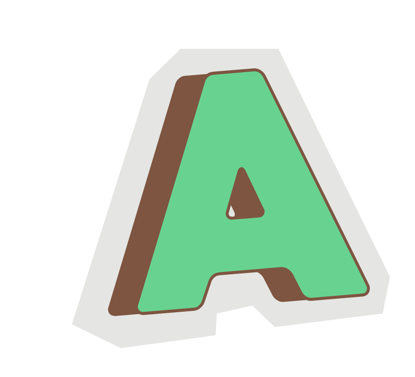

<div id="top">

<!-- HEADER STYLE: CLASSIC -->
<div align="center">



# AROANDSWORD

<em></em>

<!-- BADGES -->


<!-- default option, no dependency badges. -->


<!-- default option, no dependency badges. -->

</div>
<br>

---

## Table of Contents

- [Table of Contents](#table-of-contents)
- [Overview](#overview)
- [Features](#features)
- [Project Structure](#project-structure)
	- [Project Index](#project-index)
- [Getting Started](#getting-started)
	- [Prerequisites](#prerequisites)
	- [Installation](#installation)
	- [Usage](#usage)
	- [Testing](#testing)
- [Roadmap](#roadmap)
- [Contributing](#contributing)
- [License](#license)
- [Acknowledgments](#acknowledgments)

---

## Overview

I developed [aro-n-sword.com](http://aro-n-sword.com/), an open-sourced, full-stack web application focused on increasing visibility and understanding of aromanticism in the LGBTQIA+ community. The project arose from identifying a critical need: aromantic individuals, who make up just 0.4% of the population, lacked engaging online resources and often face AI-driven discrimination in content moderation. 

As the sole developer, I built an interactive platform featuring educational resources and community-building elements like a Bingo game. This first-of-its-kind website has created an accessible space for learning about aromantic experiences while fostering community engagement through its dynamic content.

---

## Features

- Interactive Education widget on LGBTQIA+

- 2 Bingo games! (You can share results with friends)

- Stress-relieving meditation page with floating cards

- *Most helpful* Resource list for the aromantic


---

## Project Structure

```sh
└── AroAndSword/
	├── LICENSE
	├── SECURITY.md
	└── aro-and-sword
		├── .gitignore
		├── README.md
		├── jsconfig.json
		├── next.config.mjs
		├── package-lock.json
		├── package.json
		├── postcss.config.mjs
		├── public
		├── src
		├── tailwind.config.js
		└── tsconfig.json
```

### Project Index

<details open>
	<summary><b><code>AROANDSWORD/</code></b></summary>
	<!-- __root__ Submodule -->
	<details>
		<summary><b>__root__</b></summary>
		<blockquote>
			<div class='directory-path' style='padding: 8px 0; color: #666;'>
				<code><b>⦿ __root__</b></code>
			<table style='width: 100%; border-collapse: collapse;'>
			<thead>
				<tr style='background-color: #f8f9fa;'>
					<th style='width: 30%; text-align: left; padding: 8px;'>File Name</th>
					<th style='text-align: left; padding: 8px;'>Summary</th>
				</tr>
			</thead>
				<tr style='border-bottom: 1px solid #eee;'>
					<td style='padding: 8px;'><b><a href='https://github.com/taraliu23/AroAndSword/blob/master/LICENSE'>LICENSE</a></b></td>
					<td style='padding: 8px;'>Code>❯ REPLACE-ME</code></td>
				</tr>
			</table>
		</blockquote>
	</details>
	<!-- aro-and-sword Submodule -->
	<details>
		<summary><b>aro-and-sword</b></summary>
		<blockquote>
			<div class='directory-path' style='padding: 8px 0; color: #666;'>
				<code><b>⦿ aro-and-sword</b></code>
			<table style='width: 100%; border-collapse: collapse;'>
			<thead>
				<tr style='background-color: #f8f9fa;'>
					<th style='width: 30%; text-align: left; padding: 8px;'>File Name</th>
					<th style='text-align: left; padding: 8px;'>Summary</th>
				</tr>
			</thead>
				<tr style='border-bottom: 1px solid #eee;'>
					<td style='padding: 8px;'><b><a href='https://github.com/taraliu23/AroAndSword/blob/master/aro-and-sword/jsconfig.json'>jsconfig.json</a></b></td>
					<td style='padding: 8px;'>Code>❯ REPLACE-ME</code></td>
				</tr>
				<tr style='border-bottom: 1px solid #eee;'>
					<td style='padding: 8px;'><b><a href='https://github.com/taraliu23/AroAndSword/blob/master/aro-and-sword/tailwind.config.js'>tailwind.config.js</a></b></td>
					<td style='padding: 8px;'>Code>❯ REPLACE-ME</code></td>
				</tr>
				<tr style='border-bottom: 1px solid #eee;'>
					<td style='padding: 8px;'><b><a href='https://github.com/taraliu23/AroAndSword/blob/master/aro-and-sword/postcss.config.mjs'>postcss.config.mjs</a></b></td>
					<td style='padding: 8px;'>Code>❯ REPLACE-ME</code></td>
				</tr>
				<tr style='border-bottom: 1px solid #eee;'>
					<td style='padding: 8px;'><b><a href='https://github.com/taraliu23/AroAndSword/blob/master/aro-and-sword/next.config.mjs'>next.config.mjs</a></b></td>
					<td style='padding: 8px;'>Code>❯ REPLACE-ME</code></td>
				</tr>
				<tr style='border-bottom: 1px solid #eee;'>
					<td style='padding: 8px;'><b><a href='https://github.com/taraliu23/AroAndSword/blob/master/aro-and-sword/package-lock.json'>package-lock.json</a></b></td>
					<td style='padding: 8px;'>Code>❯ REPLACE-ME</code></td>
				</tr>
				<tr style='border-bottom: 1px solid #eee;'>
					<td style='padding: 8px;'><b><a href='https://github.com/taraliu23/AroAndSword/blob/master/aro-and-sword/package.json'>package.json</a></b></td>
					<td style='padding: 8px;'>Code>❯ REPLACE-ME</code></td>
				</tr>
				<tr style='border-bottom: 1px solid #eee;'>
					<td style='padding: 8px;'><b><a href='https://github.com/taraliu23/AroAndSword/blob/master/aro-and-sword/tsconfig.json'>tsconfig.json</a></b></td>
					<td style='padding: 8px;'>Code>❯ REPLACE-ME</code></td>
				</tr>
			</table>
			<!-- src Submodule -->
			<details>
				<summary><b>src</b></summary>
				<blockquote>
					<div class='directory-path' style='padding: 8px 0; color: #666;'>
						<code><b>⦿ aro-and-sword.src</b></code>
					<!-- app Submodule -->
					<details>
						<summary><b>app</b></summary>
						<blockquote>
							<div class='directory-path' style='padding: 8px 0; color: #666;'>
								<code><b>⦿ aro-and-sword.src.app</b></code>
							<table style='width: 100%; border-collapse: collapse;'>
							<thead>
								<tr style='background-color: #f8f9fa;'>
									<th style='width: 30%; text-align: left; padding: 8px;'>File Name</th>
									<th style='text-align: left; padding: 8px;'>Summary</th>
								</tr>
							</thead>
								<tr style='border-bottom: 1px solid #eee;'>
									<td style='padding: 8px;'><b><a href='https://github.com/taraliu23/AroAndSword/blob/master/aro-and-sword/src/app/layout.js'>layout.js</a></b></td>
									<td style='padding: 8px;'>Code>❯ REPLACE-ME</code></td>
								</tr>
								<tr style='border-bottom: 1px solid #eee;'>
									<td style='padding: 8px;'><b><a href='https://github.com/taraliu23/AroAndSword/blob/master/aro-and-sword/src/app/page.js'>page.js</a></b></td>
									<td style='padding: 8px;'>Code>❯ REPLACE-ME</code></td>
								</tr>
								<tr style='border-bottom: 1px solid #eee;'>
									<td style='padding: 8px;'><b><a href='https://github.com/taraliu23/AroAndSword/blob/master/aro-and-sword/src/app/index.js'>index.js</a></b></td>
									<td style='padding: 8px;'>Code>❯ REPLACE-ME</code></td>
								</tr>
								<tr style='border-bottom: 1px solid #eee;'>
									<td style='padding: 8px;'><b><a href='https://github.com/taraliu23/AroAndSword/blob/master/aro-and-sword/src/app/globals.css'>globals.css</a></b></td>
									<td style='padding: 8px;'>Code>❯ REPLACE-ME</code></td>
								</tr>
							</table>
							<!-- resources Submodule -->
							<details>
								<summary><b>resources</b></summary>
								<blockquote>
									<div class='directory-path' style='padding: 8px 0; color: #666;'>
										<code><b>⦿ aro-and-sword.src.app.resources</b></code>
									<table style='width: 100%; border-collapse: collapse;'>
									<thead>
										<tr style='background-color: #f8f9fa;'>
											<th style='width: 30%; text-align: left; padding: 8px;'>File Name</th>
											<th style='text-align: left; padding: 8px;'>Summary</th>
										</tr>
									</thead>
										<tr style='border-bottom: 1px solid #eee;'>
											<td style='padding: 8px;'><b><a href='https://github.com/taraliu23/AroAndSword/blob/master/aro-and-sword/src/app/resources/page.js'>page.js</a></b></td>
											<td style='padding: 8px;'>Code>❯ REPLACE-ME</code></td>
										</tr>
									</table>
								</blockquote>
							</details>
							<!-- components Submodule -->
							<details>
								<summary><b>components</b></summary>
								<blockquote>
									<div class='directory-path' style='padding: 8px 0; color: #666;'>
										<code><b>⦿ aro-and-sword.src.app.components</b></code>
									<table style='width: 100%; border-collapse: collapse;'>
									<thead>
										<tr style='background-color: #f8f9fa;'>
											<th style='width: 30%; text-align: left; padding: 8px;'>File Name</th>
											<th style='text-align: left; padding: 8px;'>Summary</th>
										</tr>
									</thead>
										<tr style='border-bottom: 1px solid #eee;'>
											<td style='padding: 8px;'><b><a href='https://github.com/taraliu23/AroAndSword/blob/master/aro-and-sword/src/app/components/LGBTQIAExplanation.jsx'>LGBTQIAExplanation.jsx</a></b></td>
											<td style='padding: 8px;'>Code>❯ REPLACE-ME</code></td>
										</tr>
										<tr style='border-bottom: 1px solid #eee;'>
											<td style='padding: 8px;'><b><a href='https://github.com/taraliu23/AroAndSword/blob/master/aro-and-sword/src/app/components/ManifestoSection.jsx'>ManifestoSection.jsx</a></b></td>
											<td style='padding: 8px;'>Code>❯ REPLACE-ME</code></td>
										</tr>
										<tr style='border-bottom: 1px solid #eee;'>
											<td style='padding: 8px;'><b><a href='https://github.com/taraliu23/AroAndSword/blob/master/aro-and-sword/src/app/components/Navbar.js'>Navbar.js</a></b></td>
											<td style='padding: 8px;'>Code>❯ REPLACE-ME</code></td>
										</tr>
										<tr style='border-bottom: 1px solid #eee;'>
											<td style='padding: 8px;'><b><a href='https://github.com/taraliu23/AroAndSword/blob/master/aro-and-sword/src/app/components/InfoSection.js'>InfoSection.js</a></b></td>
											<td style='padding: 8px;'>Code>❯ REPLACE-ME</code></td>
										</tr>
										<tr style='border-bottom: 1px solid #eee;'>
											<td style='padding: 8px;'><b><a href='https://github.com/taraliu23/AroAndSword/blob/master/aro-and-sword/src/app/components/Header.js'>Header.js</a></b></td>
											<td style='padding: 8px;'>Code>❯ REPLACE-ME</code></td>
										</tr>
										<tr style='border-bottom: 1px solid #eee;'>
											<td style='padding: 8px;'><b><a href='https://github.com/taraliu23/AroAndSword/blob/master/aro-and-sword/src/app/components/PostItCard.jsx'>PostItCard.jsx</a></b></td>
											<td style='padding: 8px;'>Code>❯ REPLACE-ME</code></td>
										</tr>
										<tr style='border-bottom: 1px solid #eee;'>
											<td style='padding: 8px;'><b><a href='https://github.com/taraliu23/AroAndSword/blob/master/aro-and-sword/src/app/components/TypewriterHero.js'>TypewriterHero.js</a></b></td>
											<td style='padding: 8px;'>Code>❯ REPLACE-ME</code></td>
										</tr>
										<tr style='border-bottom: 1px solid #eee;'>
											<td style='padding: 8px;'><b><a href='https://github.com/taraliu23/AroAndSword/blob/master/aro-and-sword/src/app/components/Resources.js'>Resources.js</a></b></td>
											<td style='padding: 8px;'>Code>❯ REPLACE-ME</code></td>
										</tr>
										<tr style='border-bottom: 1px solid #eee;'>
											<td style='padding: 8px;'><b><a href='https://github.com/taraliu23/AroAndSword/blob/master/aro-and-sword/src/app/components/Bingo.js'>Bingo.js</a></b></td>
											<td style='padding: 8px;'>Code>❯ REPLACE-ME</code></td>
										</tr>
										<tr style='border-bottom: 1px solid #eee;'>
											<td style='padding: 8px;'><b><a href='https://github.com/taraliu23/AroAndSword/blob/master/aro-and-sword/src/app/components/Footer.js'>Footer.js</a></b></td>
											<td style='padding: 8px;'>Code>❯ REPLACE-ME</code></td>
										</tr>
										<tr style='border-bottom: 1px solid #eee;'>
											<td style='padding: 8px;'><b><a href='https://github.com/taraliu23/AroAndSword/blob/master/aro-and-sword/src/app/components/HeroSection.js'>HeroSection.js</a></b></td>
											<td style='padding: 8px;'>Code>❯ REPLACE-ME</code></td>
										</tr>
									</table>
								</blockquote>
							</details>
							<!-- manifesto Submodule -->
							<details>
								<summary><b>manifesto</b></summary>
								<blockquote>
									<div class='directory-path' style='padding: 8px 0; color: #666;'>
										<code><b>⦿ aro-and-sword.src.app.manifesto</b></code>
									<table style='width: 100%; border-collapse: collapse;'>
									<thead>
										<tr style='background-color: #f8f9fa;'>
											<th style='width: 30%; text-align: left; padding: 8px;'>File Name</th>
											<th style='text-align: left; padding: 8px;'>Summary</th>
										</tr>
									</thead>
										<tr style='border-bottom: 1px solid #eee;'>
											<td style='padding: 8px;'><b><a href='https://github.com/taraliu23/AroAndSword/blob/master/aro-and-sword/src/app/manifesto/page.js'>page.js</a></b></td>
											<td style='padding: 8px;'>Code>❯ REPLACE-ME</code></td>
										</tr>
									</table>
								</blockquote>
							</details>
							<!-- pages Submodule -->
							<details>
								<summary><b>pages</b></summary>
								<blockquote>
									<div class='directory-path' style='padding: 8px 0; color: #666;'>
										<code><b>⦿ aro-and-sword.src.app.pages</b></code>
									<table style='width: 100%; border-collapse: collapse;'>
									<thead>
										<tr style='background-color: #f8f9fa;'>
											<th style='width: 30%; text-align: left; padding: 8px;'>File Name</th>
											<th style='text-align: left; padding: 8px;'>Summary</th>
										</tr>
									</thead>
										<tr style='border-bottom: 1px solid #eee;'>
											<td style='padding: 8px;'><b><a href='https://github.com/taraliu23/AroAndSword/blob/master/aro-and-sword/src/app/pages/what-is-aromanticism.js'>what-is-aromanticism.js</a></b></td>
											<td style='padding: 8px;'>Code>❯ REPLACE-ME</code></td>
										</tr>
										<tr style='border-bottom: 1px solid #eee;'>
											<td style='padding: 8px;'><b><a href='https://github.com/taraliu23/AroAndSword/blob/master/aro-and-sword/src/app/pages/sam-model.js'>sam-model.js</a></b></td>
											<td style='padding: 8px;'>Code>❯ REPLACE-ME</code></td>
										</tr>
									</table>
								</blockquote>
							</details>
							<!-- bingo Submodule -->
							<details>
								<summary><b>bingo</b></summary>
								<blockquote>
									<div class='directory-path' style='padding: 8px 0; color: #666;'>
										<code><b>⦿ aro-and-sword.src.app.bingo</b></code>
									<table style='width: 100%; border-collapse: collapse;'>
									<thead>
										<tr style='background-color: #f8f9fa;'>
											<th style='width: 30%; text-align: left; padding: 8px;'>File Name</th>
											<th style='text-align: left; padding: 8px;'>Summary</th>
										</tr>
									</thead>
										<tr style='border-bottom: 1px solid #eee;'>
											<td style='padding: 8px;'><b><a href='https://github.com/taraliu23/AroAndSword/blob/master/aro-and-sword/src/app/bingo/page.js'>page.js</a></b></td>
											<td style='padding: 8px;'>Code>❯ REPLACE-ME</code></td>
										</tr>
									</table>
								</blockquote>
							</details>
						</blockquote>
					</details>
				</blockquote>
			</details>
		</blockquote>
	</details>
</details>

---

## Getting Started

### Prerequisites

This project requires the following dependencies:

- **Programming Language:** JavaScript
- **Package Manager:** Npm

### Installation

Build AroAndSword from the source and intsall dependencies:

1. **Clone the repository:**

	```sh
	❯ git clone https://github.com/taraliu23/AroAndSword
	```

2. **Navigate to the project directory:**

	```sh
	❯ cd AroAndSword
	```

3. **Install the dependencies:**

<!-- SHIELDS BADGE CURRENTLY DISABLED -->
	<!-- [![npm][npm-shield]][npm-link] -->
	<!-- REFERENCE LINKS -->
	<!-- [npm-shield]: https://img.shields.io/badge/npm-CB3837.svg?style={badge_style}&logo=npm&logoColor=white -->
	<!-- [npm-link]: https://www.npmjs.com/ -->

	**Using [npm](https://www.npmjs.com/):**

	```sh
	❯ npm install
	```

### Usage

Run the project with:

**Using [npm](https://www.npmjs.com/):**
```sh
npm start
```

### Testing

Aroandsword uses the {__test_framework__} test framework. Run the test suite with:

**Using [npm](https://www.npmjs.com/):**
```sh
npm test
```

---

## Roadmap

- [X] **`Task 1`**: <strike>Implement feature one.</strike>
- [ ] **`Task 2`**: Implement feature two.
- [ ] **`Task 3`**: Implement feature three.

---

## Contributing

- **💬 [Join the Discussions](https://github.com/taraliu23/AroAndSword/discussions)**: Share your insights, provide feedback, or ask questions.
- **🐛 [Report Issues](https://github.com/taraliu23/AroAndSword/issues)**: Submit bugs found or log feature requests for the `AroAndSword` project.
- **💡 [Submit Pull Requests](https://github.com/taraliu23/AroAndSword/blob/main/CONTRIBUTING.md)**: Review open PRs, and submit your own PRs.

<details closed>
<summary>Contributing Guidelines</summary>

1. **Fork the Repository**: Start by forking the project repository to your github account.
2. **Clone Locally**: Clone the forked repository to your local machine using a git client.
   ```sh
   git clone https://github.com/taraliu23/AroAndSword
   ```
3. **Create a New Branch**: Always work on a new branch, giving it a descriptive name.
   ```sh
   git checkout -b new-feature-x
   ```
4. **Make Your Changes**: Develop and test your changes locally.
5. **Commit Your Changes**: Commit with a clear message describing your updates.
   ```sh
   git commit -m 'Implemented new feature x.'
   ```
6. **Push to github**: Push the changes to your forked repository.
   ```sh
   git push origin new-feature-x
   ```
7. **Submit a Pull Request**: Create a PR against the original project repository. Clearly describe the changes and their motivations.
8. **Review**: Once your PR is reviewed and approved, it will be merged into the main branch. Congratulations on your contribution!
</details>

<details closed>
<summary>Contributor Graph</summary>
<br>
<p align="left">
   <a href="https://github.com{/taraliu23/AroAndSword/}graphs/contributors">
	  
   </a>
</p>
</details>

---

## License

Aroandsword is protected under the [LICENSE](https://choosealicense.com/licenses) License. For more details, refer to the [LICENSE](https://choosealicense.com/licenses/) file.

---

## Acknowledgments

- Credit `contributors`, `inspiration`, `references`, etc.

<div align="right">

[![][back-to-top]](#top)

</div>


[back-to-top]: https://img.shields.io/badge/-BACK_TO_TOP-151515?style=flat-square


---
